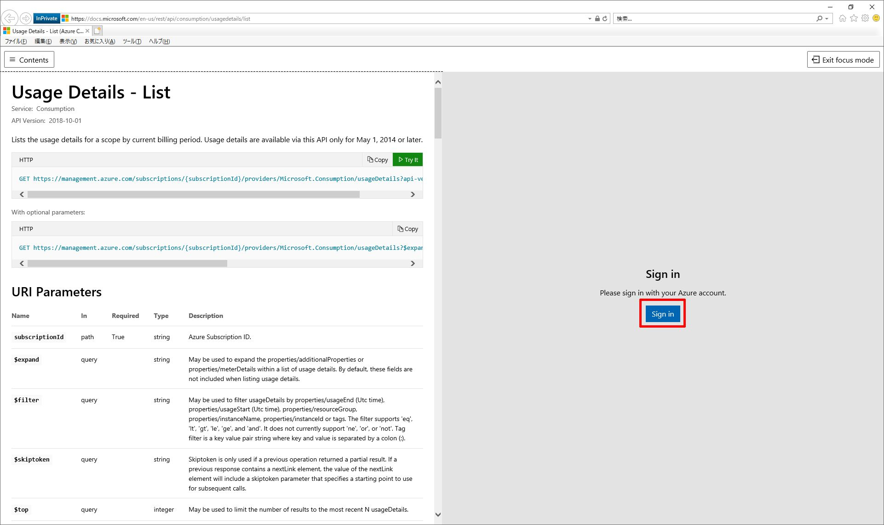
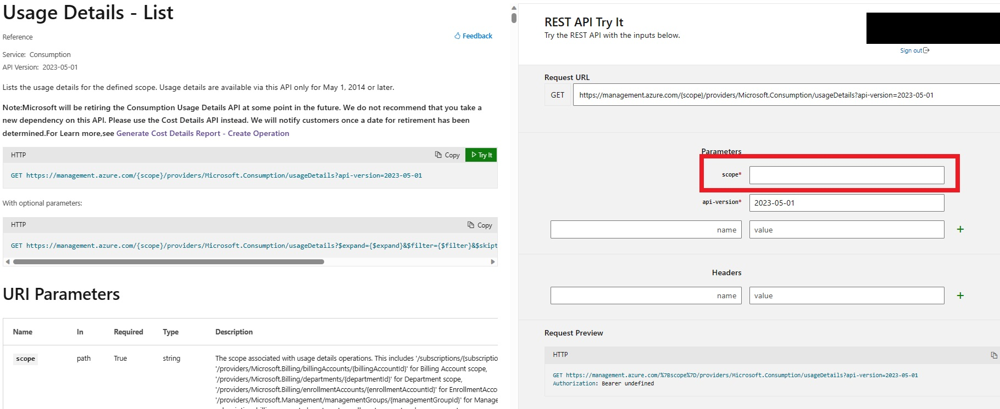
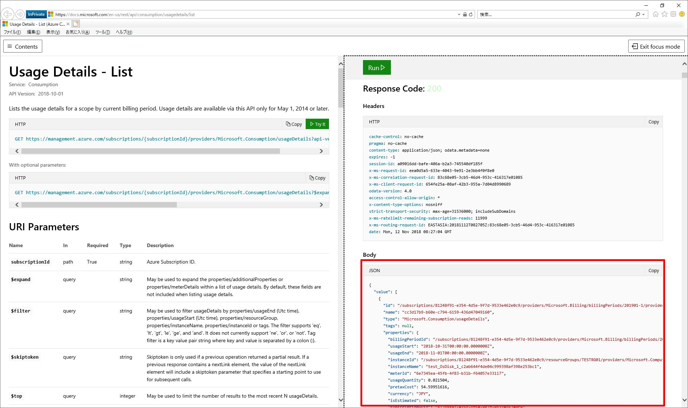

いつも大変お世話になります。Microsoft Azure サポート チームです。
Azure REST API についてご案内させていただきます。
ご参考になりましたら幸いです。

## 本記事の目的

本記事では、簡単に Azure REST API を使用する方法をご案内いたします。
Azure REST API を使用することで、Azure の様々な情報を参照・更新することができます。
本来、何かしらのプログラムから Azure REST API を呼び出し、お客様独自のシステムを構築するために用意されているものとなります。

例えば・・・
-   Azure VM の操作に特化した社内用 Web サイトを作りたい
-   自社ビジネスに合った使用状況・課金管理のツールを作りたい

このような時に、.NET や Java、その他様々なフレームワークを使用して Azure REST API の呼び出し、その結果の加工などを同フレームワークを使用して行っていただき、上記のような仕組みを独自に実装してもらうものとなります。
開発環境の用意や要件定義を伴うこと、また、呼び出し方法やデータの加工などはご利用いただくフレームワークにより様々なため、なかなか Azure REST API 自体の使用方法やどのような結果が得られるものかなどについてイメージをしにくい側面があります。

本記事では、まずは簡単に Azure REST API をご利用いただきそのイメージを掴んでいただくための簡易な方法をご案内することを目的としています。
上記のようなお客様独自のシステムを構築する際に採用をしていただける現実的な方法ではないものとなりますが、「ちょっと Azure REST API の動作を試したい」「Azure REST API の呼び出し方を事前に勉強しておきたい」などの時にお役に立てば幸いです。

なお例として「Usage Details」を使用しておりますが、実行するアカウントは対象サブスクリプションに対して権限を有している事が前提となりますので、ご承知おき下さい。（関連するドキュメント：[スコープを理解して使用する](https://learn.microsoft.com/ja-jp/azure/cost-management-billing/costs/understand-work-scopes)）

> [!NOTE]
> Azure REST API について全てをご案内するものではありません。 是非、関連する弊社公開情報も併せてご参照いただけたら幸いです。

## Azure REST API とは

Azure REST API とは、Azure の各サービスごとに用意されている REST API です。
その総称を Azure REST API と呼んでいます。
例えば、お客様社内で以下のようなアプリケーションの構築をご検討いただいているとします。

-   自社ビジネスに合った Azure の使用状況・課金管理のツール

一例ではありますが、このアプリケーションを構成するものには以下のようなものが考えられます。 (あくまで一例です)

-   画面
-   データベース
-   このアプリケーション自体の権限管理ロジック
-   各業務ロジック
-   Azure データの制御ロジック
-   その他

一般的にこの中の「Azure データの制御ロジック」内で、適切な Azure REST API の呼び出しを行っていただくものとなります。
つまり、Azure REST API のみで何かを実現できるものではなく、お客様にご検討をいただいている独自の仕組みの中の一部としてご利用をご検討いただくものが Azure REST API になります。
各種Azure REST API は以下の弊社公開情報からご確認をいただけます。

[Azure REST API Reference](https://docs.microsoft.com/en-us/rest/api/azure/)

このページの画面左に、全ての Azure REST API がツリー形式で表示されます。

 

例えば、Azure の課金に関する API である、「Consumption」を見てみましょう。
画面左から「Consumption」を展開します。

すると、更にその配下に様々な API (Aggregated Cost、Balances、Budgets など) が存在していることが確認できます。
その中の「Usage Details」を展開すると、更に細かいオペレーション (List、List By Billing Account など) が確認できます。


Azure REST API はこのように体系的に管理されています。
この中からお客様が検討されている独自のシステムを実現するための Azure REST API を見つけていただきます。
それぞれの API やオペレーションについて、各ページに詳細をご案内していますので併せてご参照いただければと思います。

## 「Try It」を使用する方法

「Try It」を使用して、Azure REST API を簡単に試す方法をご案内します。
ここでは、\[Consumption\] - \[Usage Details\] API の \[List\] オペレーションで手順をご案内します。
以下の手順を実施してください。

1.  ブラウザーをすべて閉じる    
    意図しないアカウントでサインインしてしまうことを避けるために、必ずすべてのブラウザーを閉じて下さい。

2.  InPrivate ブラウザーを起動する    
    同様に、意図しないアカウントでサインインしてしまうことを避けるために、必ず InPrivate ブラウザーで実施してください。
    
3.  以下の URL にアクセスをする
    [Usage Details - List](https://learn.microsoft.com/en-us/rest/api/consumption/usage-details/list?view=rest-consumption-2023-05-01&tabs=HTTP)

4.  「Tri It」をクリックする
    
    
5.  「Sign in」をクリックする
     
    
6.  ご利用のアカウントでサインインをする
     
    
7.  Usage Detailsの取得対象のスコープ（ サブスクリプションスコープであれば、</subscriptions/{subscriptionId}> の形式にて、{subscriptionId}の部分を対象のサブスクリプションIDにご記入下さい。）を入力し、「Run」をクリックする
    ※ 関連：[Azure portal でサブスクリプションとテナントの ID を取得する](https://learn.microsoft.com/ja-jp/azure/azure-portal/get-subscription-tenant-id)

    
    
8.  この API が実行されて、結果が表示されることを確認する
    
    

以上で「Try It」を使用した Azure REST API の呼び出しは終了です。
上記 7. の画面からも分かる通り、「Try It」でも様々なパラメーターを設定して Azure REST API を呼び出せます。

是非、色々お試しいただければと思います。

## 「PowerShell」を使用する方法

次に「PowerShell」を使用して、Azure REST API を簡単に試す方法をご案内します。
上記「Try It」でも様々お試しいただけますが、よりプログラミングからの使用をイメージしやすい方法となります。
同様に、[Usage Details - List](https://learn.microsoft.com/en-us/rest/api/consumption/usage-details/list?view=rest-consumption-2023-05-01&tabs=HTTP)オペレーションで手順をご案内します。
以下の手順を実施してください。なおAzure PowerShellのインストールが必要となりますので、[Azure PowerShell をインストールする方法](https://learn.microsoft.com/ja-jp/powershell/azure/install-azure-powershell?view=azps-11.0.0) ご参照の上、ご用意くださればと思います。
    
1.  対象のサブスクリプションIDを修正し、以下のコマンドを実行する
    ※ 関連：[Azure portal でサブスクリプションとテナントの ID を取得する](https://learn.microsoft.com/ja-jp/azure/azure-portal/get-subscription-tenant-id)

```PowerShell
Connect-AzAccount -tenant "＜テナント ID ＞" -Subscription "＜サブスクリプション ID ＞"
```
    
2.  認証画面が表示されるので、ご利用のアカウントでサインインをする
    
    
    
3.  以下のコマンドを実行して、SubscriptionID を取得する
```PowerShell
$subscriptionid = (Get-AzContext).Subscription.Id
```

4.  以下のコマンドを実行して Token を取得する
```PowerShell
$getaccess = Get-AzAccessToken
```
    
5.  以下のコマンドを実行して、Azure REST API を呼び出すための URL を作成する
```PowerShell
$url = "https://management.azure.com/subscriptions/" + $subscriptionId + "/providers/Microsoft.Consumption/usageDetails?api-version=2023-05-01"
```

6.  以下のコマンドを実行して、Azure REST API を呼び出すためメソッド、Bearerトークン、コンテンツタイプを指定する
```PowerShell
$method = "GET"
$authHeader = "Bearer " + $getaccess.Token 
$requestHeader = @{Authorization = $authHeader}
$contenttype = "application/json"
```

7.  以下のコマンドを実行して、Azure REST API を呼び出し、その結果を取得する
```PowerShell
$response = Invoke-WebRequest -Uri $url -Method $method -Headers $requestHeader -ContentType $contenttype
```

8.  以下のコマンドを実行して、Azure REST API の結果を表示する
```PowerShell
ConvertFrom-Json $response | ConvertTo-Json
```

> [!NOTE]
> 今回のサンプルでは"nextLink"の処理を考慮しておらず、対象のデータ数が多い場合は一部データが含まれない可能性がございます。"nextLink"に関しては、[Async operations, throttling, and paging](https://learn.microsoft.com/en-us/rest/api/azure/#async-operations-throttling-and-paging) をご参照下さい。

以上で「PowerShell」を使用した Azure REST API の呼び出しは終了です。
是非、色々お試しいただければと思います。

## 関連する弊社公開情報

Azure REST API について、弊社の様々な公開情報を以下にご案内します。
併せてご利用ください。

Azure REST API Reference
[https://docs.microsoft.com/en-us/rest/api/azure/](https://docs.microsoft.com/en-us/rest/api/azure/)

REST API ブラウザー
[https://docs.microsoft.com/ja-jp/rest/api/](https://docs.microsoft.com/ja-jp/rest/api/)

REST API を使用して Azure リソースの使用状況を確認する
[https://docs.microsoft.com/ja-jp/azure/billing/billing-review-service-usage-api](https://docs.microsoft.com/ja-jp/azure/billing/billing-review-service-usage-api)

Azure 監視 REST API のチュートリアル
[https://docs.microsoft.com/ja-jp/azure/monitoring-and-diagnostics/monitoring-rest-api-walkthrough](https://docs.microsoft.com/ja-jp/azure/monitoring-and-diagnostics/monitoring-rest-api-walkthrough)

RBAC と REST API を使用してアクセスを管理する
[https://docs.microsoft.com/ja-jp/azure/role-based-access-control/role-assignments-rest](https://docs.microsoft.com/ja-jp/azure/role-based-access-control/role-assignments-rest)

Azure REST API を使用して Security Center のコンプライアンス結果を確認する
[https://docs.microsoft.com/ja-jp/azure/security-center/security-center-compliance-rest-api](https://docs.microsoft.com/ja-jp/azure/security-center/security-center-compliance-rest-api)

Azure REST API を使用して Hadoop クラスターを作成する
[https://docs.microsoft.com/ja-jp/azure/hdinsight/hdinsight-hadoop-create-linux-clusters-curl-rest](https://docs.microsoft.com/ja-jp/azure/hdinsight/hdinsight-hadoop-create-linux-clusters-curl-rest)

REST API で Azure Blueprint を定義して割り当てる
[https://docs.microsoft.com/ja-jp/azure/governance/blueprints/create-blueprint-rest-api](https://docs.microsoft.com/ja-jp/azure/governance/blueprints/create-blueprint-rest-api)

以上の通りご案内いたします。

引き続き弊社製品・サービスについてお客様のお役に立てる情報のご案内に努めさせていただきます。

よろしくお願いします。