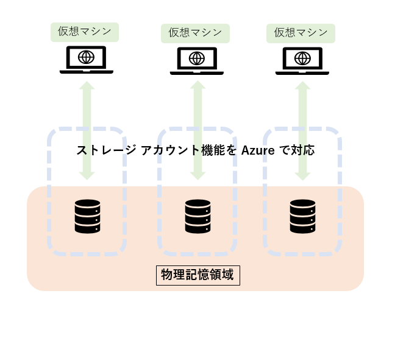

皆さん こんにちは。Microsoft Azure サポート チームです。

本記事では管理ディスクについて、その概要と課金に関する点をご案内します。ぜひ ストレージ アカウントの記事と合わせてご覧ください。

-   管理ディスクの概要
      1.  管理ディスクの種類

-   管理ディスクの料金の考え方
      1.  基本的な課金要素について
      2.  データ保持に関する課金について
      3.  各課金要素の使用量の算出の考え方について
-   参考情報

### 管理ディスクの概要

___

これまでストレージ アカウントでディスクという概念でストレージを使用しようとした場合は、ページ BLOB を作成していました。

また VM 作成時の OS ディスクを指定する場合にも、ストレージ アカウントを設定し、使用していました。そのためストレージ アカウントとしての制限により、想定したような動作とならなかったりすることがありました。

何よりオンプレミスの HDD のような単独での取り扱いのしやすさを求める利用者の声も多く、それを実現するものとして管理ディスク（ Managed Disk ）が用意されました。

管理ディスクはこれまでお客様が作成、管理しなければいけなかった ストレージ アカウントの仕組みの部分を Azure 側が管理するようになっています。

ユーザーは Azure ポータルからリソースとして "ディスク" を選択することで管理ディスクを作成できます。そうして作成した管理ディスクを既存の VM のデータディスクとして利用することも可能です。また現在では VM を新規作成する際には、 OS 用ディスクとして最初から管理ディスクを作成して利用することができます。

 

#### **1.管理ディスクの種類**

管理ディスクには以下の 4 つの種類があります。

Premium SSD ・・・　ミッション クリティカルな運用環境をホストしている VM 向けの高パフォーマンスなディスク

Standard SSD　・・・　一般的なアプリ利用や開発向けのバランスのよいディスク

Standard HDD　・・・　データバックアップや不定期に起こるアクセス向けのコスト効果の高いディスク

Ultra SSD　・・・　2018 / 11 月時点でプレビューです

それぞれの種類により、設定できる汎用性や、基本料金が異なります。
なお、この種類の選択は、管理ディスクだけでなく、一部 Blob ストレージでも同じように選択が可能です。

### 管理ディスクの料金の考え方

___

ディスクの種類にもよりますが、ストレージ アカウントに比べて分かりやすくなっています。

#### **1. 基本的な課金要素について**

管理ディスクは以下の使用量に対して課金が発生します。

1.  トランザクション量
2.  データ転送量
3.  スナップショット

また、管理ディスクを作成した際に選択した項目（ディスクの種類、ディスク サイズ）により基本料金が異なります。

#### **2.データ保持に関する課金について**

保存しているデータに対する課金ですが、管理ディスクの場合には、作成時に選択されたディスクのサイズによって料金が異なります。そのディスク中に保存しているデータ量が多くても少なくても料金は変わりません。

ここが Standard ストレージアカウントを利用したディスク料金の考え方と大きく違うところです。

ディスクのサイズについては複数の固定サイズが用意されており、管理ディスク作成時に指定したデータサイズを格納することができる最も少ないサイズのディスクが自動的に割り当てられます。

例えばディスクサイズとして 128GB, 256GB, 512GB, 1TB, 2TB, 4TB というように用意されていたとします。管理ディスク作成時に保存見込みデータ量として 500GB を指定した場合、割り当てられるディスクサイズは 512GB となります。

そのため、見積もりでは 50 ～ 200GB 程度利用する予定ではあるが、余裕をもって 300GB を指定すると、512GB のディスクが割り当てられるので、保存しているデータ量が少なくても料金は 512GB のディスク金額に固定されてしまいます。そのため当初は少な目のサイズを選択し、後日利用量が増えて割り当てられたディスクサイズ以上となりそうになった時点でディスクサイズを大きいものに変更する、などといった対応が可能です。ただしディスクサイズを大きくすることはできますが、小さくすることはできませんので、運用については十分ご検討いただければと思います。

なお、ディスクサイズの料金は月額になります。もし利用期間が 1 か月未満の場合には、月額をベースとして時間単位で課金されます。

管理ディスクの種類や用意されているディスクサイズ、それぞれの料金などについては以下のサイトご覧ください。

\- Managed Disks の価格

[https://azure.microsoft.com/ja-jp/pricing/details/managed-disks/](https://azure.microsoft.com/ja-jp/pricing/details/managed-disks/)

#### **3. 各課金要素の使用量の算出の考え方について**

##### a) トランザクション量

 こちらは管理ディスクの種類によって異なります。

ⅰ) Premium SSD

トランザクション量に対する課金はありません

ⅱ) Standard SSD

Standard SSD の場合は、I/O のブロックサイズが 256 KB を超える単位であった場合、256 KB をブロックサイズとしてトランザクションを計算します。

例えば 4KB 単位で I/O を行うアプリケーションがあったとすると、4KB は 256KB を超えないので、1GB 書き込み時のトランザクションは Standard HDD 同様に以下のようになります。

・ 1,048,576 KB / 4KB = 262,144 トランザクション

512KB 単位で I/O が行われた場合、512KB は 256KB を超過しますので、トランザクションの計算単位としては 256 KB が適用されます。

・ 1,048,576 KiB / 256KiB = 4,096 トランザクション

ⅲ) Standard HDD

ストレージ アカウントの場合と同じく、I/Oの際のブロックサイズがベースとなります。

#####  b) データ転送量

基本的な考え方はストレージ アカウントと同じです。

##### c) スナップショット

スナップショットはディスクのバックアップイメージです。管理ディスクの通常の保存データの課金方式とは異なり、こちらは保存されたスナップショットのサイズに対して課金が発生します。

Premium SSD/Standard SSD は、スナップショットの保存先に SSD/HDD いずれかを選択できます。それぞれ月額の基本料金が異なります。

なお、Standard HDD は HDD のみ選択可能です。

### 参考情報

___

〇 Azure ディスクストレージの種類 ( 2018 年 6 月現在 )

[https://blogs.technet.microsoft.com/jpaztech/2018/06/11/choose\_azure\_disk/](https://apac01.safelinks.protection.outlook.com/?url=https%3A%2F%2Fblogs.technet.microsoft.com%2Fjpaztech%2F2018%2F06%2F11%2Fchoose_azure_disk%2F&data=02%7C01%7C%7Cd5a3ef8fb0ea427bc2da08d681107a5b%7C72f988bf86f141af91ab2d7cd011db47%7C1%7C0%7C636838305111268321&sdata=GmWjzCwHbQJVUODBsi5Kg5a8kS%2BnTAzIXTD%2FKC5%2F3T4%3D&reserved=0)

〇 What disk types are available in Azure?

[https://docs.microsoft.com/ja-jp/azure/virtual-machines/windows/disks-types](https://docs.microsoft.com/ja-jp/azure/virtual-machines/windows/disks-types)

〇 Managed Disks の価格

[https://azure.microsoft.com/ja-jp/pricing/details/managed-disks/](https://azure.microsoft.com/ja-jp/pricing/details/managed-disks/)

ご案内内容は以上です。

こちらの情報が少しでも皆様のお役に立てれば幸いです。